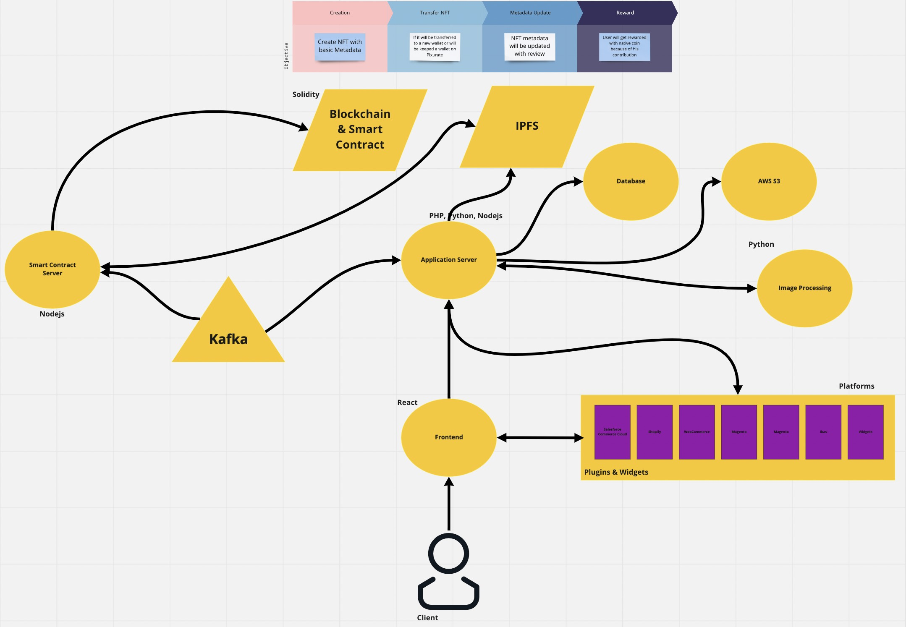

# PIXURATE

**This product is an MVP**

Pixurate is developing **a review system on blockchain** for eCommerce owners to **boost their engagement** and **collect authentic reviews.**

## WHY WE BUILD IT

**Blockchain** can bring extraordinary transparency to review systems and provide users with the most accurate information. In the **WEB2** world, all reviews are stored in 3rd party or in-house databases, and this information can be **easily manipulated**. Moreover, **even the industry leader, Trustpilot**, cannot offer a secure order verification mechanism. From this point of view, **we decided to develop the web3 version of Trustpilot**, and **our WEB3 approach solves the problem in all its aspects with a magical way by using web3.**

### PROBLEM

eCommerce owners suffer from:
- Low customer engagement: People only tend to leave a review for bad experiences,
- Fabricated reviews: bots contaminate and manipulate review and rating systems,
- High investment requirements for firms to enter web3,
- Need for credible, authentic testimonials and widgets that show their quality.

### SOLUTION

Pixurate:
- Builds the most trustable and original order verification system using blockchain
- Boosts customer engagement with NFTs and incentivizes feedback contribution with token rewards
- Generates AI-powered NFTs for websites without huge development expenses
- Provides websites withintegrable widgets for reviews, ratings, testimonials and marketing.

### HACKATHON TRACKS

Pixurate addresses three tracks on Polygon Hackathon. 
Our main track is the Web3 integration of user review systems on eCommerce platforms.

Web3 Integration in Web2 - Pixurate provides a seamless integration with Web2 Ecommerce platforms. With Pixurate integration, online purchases are awarded with unique NFTs that include the purhcase metadata. These NFTs prove verification of NFT owners on blockchain. Verified NFT users' feedback on Pixurate platform is stored and visible on blockchain and it is the transparent and secure version of user review systems.

Nfts - Pixurate generates AI-powered NFTs of physical products purchased online. Each Pixurate NFT represents a specific purchase with its metadata. Users store their NFTs on the Pixurate app and give feedback on their purchases. Pixurate NFTs can be shared on social media for interaction. NFT owners are eligible for awards for their engagement. 

Public Goods - Pixurate offers an innovative Web3 application to solve the problems of review manipulation and consumer rights to share and access true consumer experience. Pixurate review system is a 3rd party organization with no conflict of interest in revealing true information and applies the highest level of purchase verification. Pixurate does not allow fake/bot reviews, review censoring and manipulation by design. Pixurate's indirect incentive mechanism motivates the consumers to share their experience and facilitate revealing the highest quality information about online shops.

## HOW IT WORKS

1. It is enough to install our plugin or widget on an ecommerce platform to generate unique NFTs.
2. When an order is completed, our plugin/widget informs us with all order information and generates an NFT that includes this order information
3. We display to customer her/his NFTs for each product that he ordered by using a widget on the order confirmation, and customer can easily see his NFT detail.
4. If customer has already an account or creates an account and connect his wallet, we are transferring this NFT to his account. (In the future, we can create a seperate wallet for each customer.)
5. If customer adds a review for this product, we are storing this review for a while (Because we are giving some time to customer if she/he changes her/his mind), and then generating a metadata information that also including this review and store it on **IPFS**.
6. We are putting **IPFS url** that including customer review and marking this NFT as reviewed on Smart Contract that we deployed (Currently, we are not storing images on IPFS, but we will do it asap)
7. Then customers review can be displayed on blockchain, and also ecommerce shop display all the reviews by using our widget.

You also want to check this url:
[https://miro.com/app/board/uXjVOrJHcOg=/?share_link_id=132326004962]

## WHAT IS THE ARCHITECTURE OF APPLICATION

Currently, we are not using exactly this architecture but in a short time we will completely use this microservice architecture. (We developed this project ~45 days as a side project as 2 developers, and as you guess we need more time for this complex architecture.)

## TECHNOLOGIES THAT WE USED

- Solidity : For coding smart contract
- Reactjs : For creating user widgets
- Nodejs : For interacting with smart contract
- PHP : For Core User application
- Vuejs: For our dashboards
- Nextjs: For our Homepage
- Salesforce Commerce Cloud: For demo shop and creating our first plugin for 3th parties
- IPFS: via NFT.Storage **(Eligibility For sponshorship prize)**
- Sequence: For connecting user wallets **(Eligibility For sponshorship prize)**
- AWS: For storing images and calculating rating average via Lambda function **(Eligibility For sponshorship prize)**
- Spheron: To deploy our home website **(Eligibility For sponshorship prize)**
- Metamask: For connecting user wallets

## HOW THE CODE WORKS

We tried to collect all repos under a single repo to make review process easier by using **Git Submodules**. You can find how each repo is working here:

### NFTURATE

It is our Core application for authentication, displaying dashboards, collecting reviews and serves widgets. It collects all requests from users and distrubite it to each request to service that responsible for. It is written with PHP and VueJS. (Laravel)

### PIXURATE WIDGETS

It is a reactjs repo that including all widgets that we created. They can be used alones or can be used by a plugin that we created. (Like PIXURATE-SFRA-CARTRIDGE).
### PIXURATE-HOME-Nextjs

It is our homepage repo and written in NEXTjs and deployed via Spheron

### PIXURATE-MINTING-SERVICE

It is a nodejs application that interacts with smart contract by using Etherjs. We are aware of that there are some security issues there but will be fixed when this project industrialized.

### PIXURATE-SFRA-CARTRIDGE

It is Salesforce Commerce Cloud Plugin that integrates our service with Salesforce Commerce Cloud, So ecommerce shop owners can easily install it. We are planning to create plugins like that for Shopify, WooCommerce, Magento, Ikas.

### PIXURATE-SMART*CONTRACTS

It is the code that we developed as smart contract.
Contract address: 0xf2EcC77c1F1fe940E800C841910EE3c436f26B58

